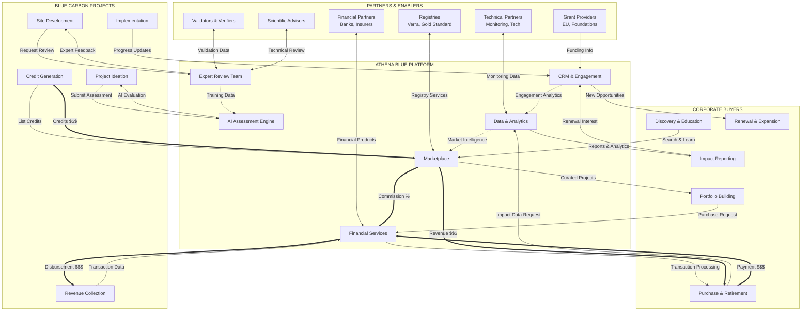
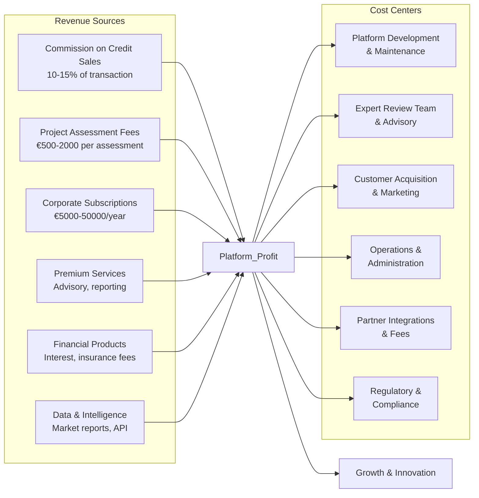

# Value Flow Diagram - Athena Blue Marketplace

## Mermaid Diagram - Full Ecosystem Value Exchange

## Detailed Value Exchange Matrix

### Projects → Athena Blue

| Value Provided | Value Received | Feedback Loop |
|---------------|----------------|---------------|
| Project data & documentation | AI-powered assessment & scoring | Assessment quality improves with each project |
| Carbon credit inventory | Marketplace listing & visibility | Market pricing data informs project planning |
| Impact metrics & monitoring data | Expert review & validation support | Expert insights train AI system |
| Success stories & case studies | Grant matching & funding connections | Funding success increases platform credibility |
| Market feedback & pricing signals | Business development support | Better projects attract more buyers |

### Athena Blue → Projects

| Value Provided                       | Value Received            | Enablers Required      |
| ------------------------------------ | ------------------------- | ---------------------- |
| Technology platform access           | Subscription/success fees | Cloud infrastructure   |
| Expert advisory services             | Quality project pipeline  | Marine science experts |
| Buyer connections & matchmaking      | Commission on sales       | Marketing reach        |
| Grant database & application support | Success story content     | Grant partnerships     |
| Regulatory navigation assistance     | Compliance documentation  | Legal expertise        |
| Financial bridge solutions           | Interest/fees             | Capital partners       |
| Marketing & visibility               | Brand association         | PR capabilities        |

### Corporates → Athena Blue

| Value Provided | Value Received | Feedback Loop |
|---------------|----------------|---------------|
| Purchase commitments & capital | Curated project portfolio | Purchase data improves curation |
| Requirements & preferences data | Quality assurance & de-risking | Buyer needs shape project development |
| Brand association & credibility | Custom reporting & dashboards | Reporting needs enhance platform features |
| Market price signals | Education & advisory services | Price signals guide market development |
| Renewal commitments | Portfolio management | Long-term relationships reduce CAC |

### Athena Blue → Corporates

| Value Provided | Value Received | Enablers Required |
|---------------|----------------|-------------------|
| Verified blue carbon credits | Payment for credits + fees | Quality control systems |
| Impact reporting & storytelling | Subscription for premium services | Reporting infrastructure |
| Portfolio recommendations | Data on preferences | AI/ML capabilities |
| Regulatory compliance support | Long-term commitments | Regulatory expertise |
| Risk mitigation & insurance options | Premium pricing acceptance | Insurance partners |
| Education & thought leadership | Brand evangelism | Content creation |

### Partners ↔ Athena Blue

| Partner Type | Value to Athena | Value from Athena | Integration Points |
|-------------|-----------------|-------------------|-------------------|
| **Registries** | Legitimacy & standards | Project pipeline & volume | API integration, compliance, methodology co-development |
| **Validators** | Quality assurance | Steady project flow | Preferred vendor agreements |
| **Financial** | Capital & risk products | Deal flow & fees | Embedded finance solutions |
| **Technical** | Monitoring & verification | Distribution channel | Data sharing agreements |
| **Grants** | Funding for projects | Success metrics | Application partnerships |
| **Scientific** | Credibility & expertise | Research opportunities & data | Advisory board structure, data consortium |
| **Methodology Partners** | Technical standards | Funding & coordination | Joint development, data sharing |

## Critical Value Creation Points

### 1. AI Assessment Engine
- **Input:** Raw project data + expert feedback
- **Process:** Machine learning on successful patterns
- **Output:** Faster, more accurate assessments
- **Value Multiplier:** Each assessment improves the system

### 2. Expert Review Loop
- **Input:** AI assessment + project documentation
- **Process:** Human expertise validates & enhances
- **Output:** Credible, investment-ready projects
- **Value Multiplier:** Builds trust with buyers

### 3. Marketplace Curation
- **Input:** Verified projects + buyer preferences
- **Process:** Matching algorithm + quality filters
- **Output:** Efficient price discovery & transactions
- **Value Multiplier:** Network effects as volume grows

### 4. Data & Analytics Platform
- **Input:** Transaction, impact, and monitoring data
- **Process:** Aggregation, analysis, visualization
- **Output:** Market intelligence & impact proof
- **Value Multiplier:** Data moat strengthens over time

### 5. Financial Services Layer
- **Input:** Transaction flow + partner products
- **Process:** Embedded finance + risk management
- **Output:** Smooth transactions + new revenue streams
- **Value Multiplier:** Sticky platform with switching costs

## Revenue Flow Architecture

## Network Effects & Moats

### Direct Network Effects
- More projects → More choice for buyers → More buyers
- More buyers → Better prices for projects → More projects
- More transactions → Better data → Better matching → More transactions

### Indirect Network Effects
- More projects → More partners interested → Better services
- More buyers → More financial products → Easier transactions
- More data → Better AI → Faster assessment → More projects

### Competitive Moats
1. **Data Moat:** Proprietary assessment and outcome data
2. **Trust Moat:** Verified track record and expert network
3. **Network Moat:** Two-sided marketplace liquidity
4. **Integration Moat:** Deep partner relationships
5. **Brand Moat:** "Athena Blue Verified" quality mark