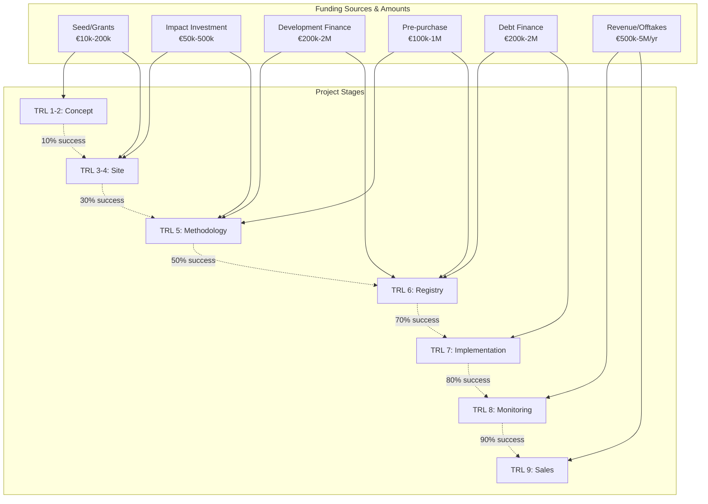

# Project Maturity Journey Map - Seagrass Restoration to Carbon Credits

## Technology Readiness Levels (TRL) Adapted for Blue Carbon Projects

```mermaid
graph LR
    subgraph "DISCOVERY PHASE"
        TRL1[TRL 1: Basic Research<br/>Scientific principles observed]
        TRL2[TRL 2: Concept Formation<br/>Restoration approach defined]
        TRL3[TRL 3: Proof of Concept<br/>Pilot studies completed]
    end
    
    subgraph "DEVELOPMENT PHASE"
        TRL4[TRL 4: Site Validation<br/>Location secured & assessed]
        TRL5[TRL 5: Methodology Design<br/>Carbon accounting validated]
        TRL6[TRL 6: Registry Ready<br/>Documentation complete]
    end
    
    subgraph "IMPLEMENTATION PHASE"
        TRL7[TRL 7: Deployment<br/>Restoration commenced]
        TRL8[TRL 8: Operations<br/>Monitoring & verification]
        TRL9[TRL 9: Market Entry<br/>Credits issued & sold]
    end
    
    TRL1 -->|6-12 months| TRL2
    TRL2 -->|3-6 months| TRL3
    TRL3 -->|6-12 months| TRL4
    TRL4 -->|6-9 months| TRL5
    TRL5 -->|3-6 months| TRL6
    TRL6 -->|3-6 months| TRL7
    TRL7 -->|12-24 months| TRL8
    TRL8 -->|6-12 months| TRL9
    
    TRL1 -.->|Total: 4-7 years| TRL9
```

## Detailed Stage Analysis with Funding & Support

### Stage 1: Idea/Concept (TRL 1-2)
**Duration:** 9-18 months | **Success Rate:** 10% advance to next stage

| Aspect | Details | Athena Blue Support |
|--------|---------|-------------------|
| **Key Activities** | • Literature review & research • Site identification • Initial feasibility assessment • Team formation | • AI feasibility checker • Research database • Expert office hours • Team matching |
| **Funding Sources** | • Personal savings (€5-20k) • University grants (€10-50k) • NGO seed funds (€10-30k) • EU Horizon grants (€50-200k) | • Grant database & alerts • Application templates • Letter of support • Pitch deck builder |
| **Critical Success Factors** | • Strong scientific basis • Clear value proposition • Passionate team • Local support | • Scientific validation • Business model canvas • Advisor connections • Community templates |
| **Typical Blockers** | • Lack of business knowledge • No clear path forward • Funding gaps • Technical complexity | • Education modules • Roadmap generator • Funding matchmaking • Technical mentors |
| **Exit Criteria** | • Validated concept • Identified site options • Initial team formed • Seed funding secured | • Concept validation report • Site assessment tool • Team readiness check • Funding tracker |

### Stage 2: Site Secured (TRL 3-4)
**Duration:** 12-18 months | **Success Rate:** 30% advance

| Aspect | Details | Athena Blue Support |
|--------|---------|-------------------|
| **Key Activities** | • Environmental impact assessment • Stakeholder engagement • Permit applications • Baseline studies • Legal structuring | • Permit navigator • Stakeholder mapping • Legal templates • Baseline protocols • Insurance guidance |
| **Funding Sources** | • Impact investors (€50-200k) • Government grants (€100-500k) • Philanthropic funds (€50-150k) • Crowdfunding (€20-100k) | • Investor introductions • Grant writing support • Crowdfunding platform • Financial planning tools |
| **Critical Success Factors** | • Secure site rights • Community buy-in • Environmental permits • Baseline data quality | • Rights verification • Engagement playbooks • Permit tracking • Data quality checks |
| **Typical Blockers** | • Permitting delays • Community opposition • Funding shortfalls • Technical challenges | • Regulatory liaisons • Mediation support • Bridge financing • Technical advisors |
| **Exit Criteria** | • Site legally secured • Permits obtained • Baseline complete • Funding for next phase | • Legal verification • Permit checklist • Baseline approval • Financial milestone |

### Stage 3: Methodology Development (TRL 5)
**Duration:** 6-9 months (if methodology exists) OR 2-4 years (if developing new) | **Success Rate:** 50% advance

| Aspect | Details | Athena Blue Support |
|--------|---------|-------------------|
| **Key Activities** | • Methodology selection (if available) • Adaptation for local context • Data collection for gaps • Additionality demonstration • Risk assessment • Monitoring plan • Peer review | • Methodology consortium participation • Data sharing network • Additionality tools • Risk templates • Monitoring protocols • Expert review network |
| **Funding Sources** | • Pre-purchase agreements (€100-500k) • Methodology development funds (€200k-1M) • Green bonds (€500k-2M) • Development finance (€200k-1M) • Carbon funds (€100-300k) | • Buyer introductions • Methodology fund access • Bond structuring • DFI connections • Fund partnerships |
| **Critical Success Factors** | • Available/adaptable methodology • Sufficient local data • Clear additionality • Peer validation • Economic viability at small scale | • Methodology development support • Data consortium access • Additionality audit • Peer facilitation • Small-scale financial modeling |
| **Typical Blockers** | • No viable methodology exists • Data gaps for species/region • Scale requirements too large • Additionality questions • Economic uncertainties • Technical complexity | • Methodology consortium leadership • Data collection coordination • Aggregation solutions • Expert consultation • Scenario planning • Technical support |
| **Exit Criteria** | • Approved/adapted methodology • Local data collected • Validated approach • Monitoring plan • Project design document | • Methodology certification • Data completeness check • Validation report • Monitoring approval • PDD review |

### Stage 4: Registry Registration (TRL 6)
**Duration:** 3-6 months | **Success Rate:** 70% advance

| Aspect | Details | Athena Blue Support |
|--------|---------|-------------------|
| **Key Activities** | • Registry selection • Application preparation • Validation body selection • Documentation compilation • Fee payment | • Registry comparison • Application support • Validator marketplace • Document templates • Fee financing |
| **Funding Sources** | • Working capital (€50-100k) • Partner advances (€50-150k) • Revenue-based financing (€100-300k) | • Working capital loans • Partner connections • RBF structuring |
| **Critical Success Factors** | • Complete documentation • Quality validation • Timely submission • Fee management | • Documentation review • Validator vetting • Timeline management • Financial planning |
| **Typical Blockers** | • Documentation gaps • Validation delays • Fee constraints • Technical issues | • Gap identification • Expedite services • Fee financing • Technical support |
| **Exit Criteria** | • Registry acceptance • Validation complete • Project registered • Ready to implement | • Registration confirmation • Validation certificate • Project listing • Implementation plan |

### Stage 5: Implementation & Baseline (TRL 7)
**Duration:** 12-24 months | **Success Rate:** 80% advance

| Aspect | Details | Athena Blue Support |
|--------|---------|-------------------|
| **Key Activities** | • Site preparation • Seagrass planting • Initial monitoring • Community engagement • Progress reporting | • Operations playbook • Equipment sourcing • Monitoring tech • Engagement tools • Reporting platform |
| **Funding Sources** | • Implementation grants (€200k-1M) • Impact investment (€500k-2M) • Corporate sponsorship (€100-500k) • Debt financing (€200k-1M) | • Grant applications • Investor network • Corporate partnerships • Debt arrangements |
| **Critical Success Factors** | • Operational excellence • Survival rates • Data quality • Stakeholder satisfaction | • Best practices • Performance tracking • Data validation • Feedback systems |
| **Typical Blockers** | • Weather events • Technical failures • Cash flow issues • Operational challenges | • Risk mitigation • Technical support • Cash management • Operations consulting |
| **Exit Criteria** | • Successful planting • Baseline established • Monitoring operational • Initial growth confirmed | • Planting verification • Baseline approval • Monitoring validation • Growth metrics |

### Stage 6: Monitoring & Verification (TRL 8)
**Duration:** 12-36 months (ongoing) | **Success Rate:** 90% advance

| Aspect | Details | Athena Blue Support |
|--------|---------|-------------------|
| **Key Activities** | • Continuous monitoring • Data collection • Annual reporting • Third-party verification • Adaptive management | • Monitoring automation • Data platform • Report generation • Verifier coordination • Management tools |
| **Funding Sources** | • Operations revenue (from credits) • Monitoring grants (€50-200k) • Service contracts (€50-150k/yr) | • Revenue optimization • Grant sourcing • Contract facilitation |
| **Critical Success Factors** | • Data integrity • Verification success • Cost efficiency • Continuous improvement | • Data validation • Verification prep • Cost optimization • Performance analytics |
| **Typical Blockers** | • Monitoring costs • Data gaps • Verification issues • Natural disasters | • Cost reduction • Gap filling • Issue resolution • Insurance claims |
| **Exit Criteria** | • Verified carbon sequestration • Credits approved • Issuance ready • Buyer interest | • Verification report • Credit calculation • Issuance support • Buyer matching |

### Stage 7: Credit Issuance & Sales (TRL 9)
**Duration:** Ongoing | **Success Rate:** 95% achieve sales

| Aspect | Details | Athena Blue Support |
|--------|---------|-------------------|
| **Key Activities** | • Credit issuance • Price discovery • Sales & marketing • Contract negotiation • Revenue management | • Issuance facilitation • Price benchmarking • Marketing support • Contract templates • Revenue optimization |
| **Funding Sources** | • Credit sales revenue • Multi-year offtakes • Premium pricing • Co-benefit monetization | • Sales platform • Offtake agreements • Premium positioning • Co-benefit packaging |
| **Critical Success Factors** | • Credit quality • Market timing • Pricing strategy • Buyer relationships | • Quality assurance • Market intelligence • Pricing guidance • Relationship management |
| **Typical Blockers** | • Market volatility • Buyer hesitation • Competition • Delivery risks | • Market hedging • Buyer education • Differentiation • Risk mitigation |
| **Exit Criteria** | • Sustainable revenue • Profitable operations • Growth potential • Market leadership | • Financial sustainability • Profit optimization • Growth planning • Market positioning |

## Funding Landscape by Stage

## Risk & Mitigation Matrix by Stage

| Stage | Primary Risks | Mitigation Strategies | Athena Blue Role |
|-------|--------------|----------------------|------------------|
| **Concept** | Technical feasibility | Pilot studies, expert review | Validation services |
| **Site** | Permitting, community | Early engagement, transparency | Stakeholder management |
| **Methodology** | Additionality, permanence | Conservative estimates, insurance | Technical review |
| **Registry** | Documentation, validation | Professional support, quality control | Process management |
| **Implementation** | Operational, environmental | Contingency planning, monitoring | Best practices |
| **Monitoring** | Data quality, costs | Automation, efficiency | Technology platform |
| **Sales** | Market, reputation | Diversification, quality | Market making |

## Key Performance Indicators by Stage

| Stage | Success Metrics | Warning Signs | Athena Blue Tracking |
|-------|----------------|---------------|---------------------|
| **TRL 1-2** | • Feasibility score >70% • Team completeness • Funding secured | • No progress 6 months • Team turnover • Funding rejected | • Monthly check-ins • Team health score • Funding pipeline |
| **TRL 3-4** | • Permits on track • Community support >60% • Baseline quality score | • Permit delays >3 months • Community opposition • Data gaps | • Permit tracker • Sentiment analysis • Data validation |
| **TRL 5** | • Methodology approved • Additionality >80% • Economic IRR >12% | • Methodology rejected • Additionality questioned • Negative NPV | • Review tracking • Additionality audit • Financial model |
| **TRL 6** | • Registration time <6mo • Validation first pass • Documentation complete | • Registration delays • Validation issues • Missing documents | • Timeline tracking • Issue resolution • Document checklist |
| **TRL 7** | • Survival rate >70% • On budget ±10% • Timeline ±3 months | • High mortality • Budget overrun >20% • Major delays | • Performance monitoring • Budget tracking • Schedule management |
| **TRL 8** | • Carbon sequestration rate • Verification success • Data completeness >95% | • Below projections • Verification failures • Data gaps | • Carbon tracking • Verification prep • Data quality score |
| **TRL 9** | • Credits sold >80% • Price >€15/ton • Buyer satisfaction >4/5 | • Low demand • Price pressure • Buyer complaints | • Sales analytics • Price monitoring • NPS tracking |