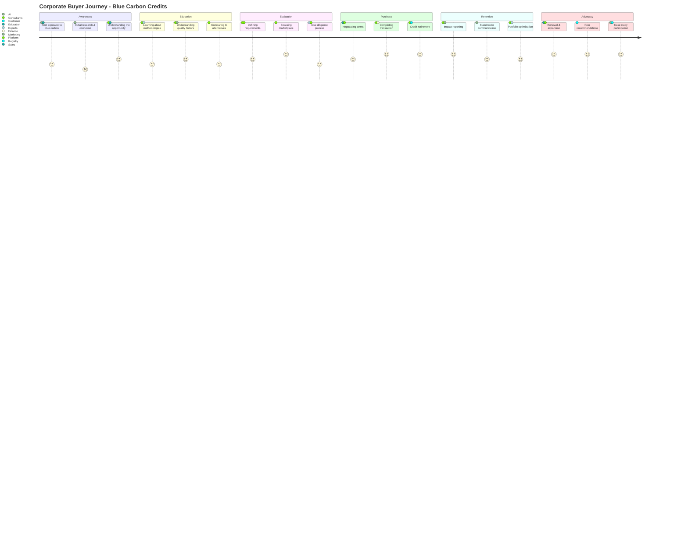

# Corporate Buyer Journey Map - From Awareness to Advocacy

## High-Level Journey Overview

## Detailed Stage Analysis

### Stage 1: AWARENESS - "We need to do something about our carbon footprint"
**Duration:** 1-3 months | **Drop-off Rate:** 60% don't progress

| Aspect | Corporate Reality | Athena Blue Intervention | Success Metrics |
|--------|------------------|-------------------------|-----------------|
| **Trigger Events** | • CEO/Board mandate • Competitor announcement • Customer pressure • Regulatory requirements • NGO campaign | • SEO/SEM presence • Thought leadership • Industry events • Partner referrals • PR campaigns | • Website traffic • Content engagement • Demo requests • Newsletter signups |
| **Initial State** | • "What is blue carbon?" • "Why not just plant trees?" • "Is this legitimate?" • "How much will it cost?" • "Will we get criticized?" | • Educational landing pages • Comparison guides • Credibility indicators • Price transparency • Success stories | • Time on site • Pages per session • Download rate • Return visits |
| **Information Seeking** | • Google searches • Industry reports • Peer conversations • Consultant advice • Conference attendance | • SEO-optimized content • Whitepapers & guides • Webinar series • Expert interviews • Conference presence | • Search rankings • Content shares • Webinar attendance • Lead quality score |
| **Key Concerns** | • Greenwashing risk • Budget allocation • Internal buy-in • Technical complexity • ROI justification | • Third-party validation • ROI calculators • Executive briefings • Simplified explanations • Business case templates | • Calculator usage • Briefing requests • Template downloads • FAQ engagement |
| **Decision Point** | "Should we explore blue carbon as part of our strategy?" | Clear value proposition + Low-commitment entry point | Conversion to education stage |

### Stage 2: EDUCATION - "We need to understand what we're buying"
**Duration:** 2-4 months | **Drop-off Rate:** 40% don't progress

| Aspect | Corporate Reality | Athena Blue Intervention | Success Metrics |
|--------|------------------|-------------------------|-----------------|
| **Learning Objectives** | • How blue carbon works • Quality differentiation • Pricing mechanisms • Risk factors • Co-benefits | • Structured learning paths • Interactive assessments • Expert office hours • Peer learning groups • Site visit opportunities | • Course completion • Assessment scores • Office hour attendance • Group participation • Visit requests |
| **Stakeholders Involved** | • Sustainability team (lead) • Finance (budget) • Legal (risk) • Marketing (story) • C-suite (approval) | • Role-specific content • Stakeholder alignment tools • Risk assessments • Marketing materials • Executive summaries | • Multi-stakeholder engagement • Tool utilization • Document sharing • Internal champion ID |
| **Comparison Shopping** | • Forest vs. ocean • Different methodologies • Various providers • Price vs. quality • Speed vs. impact | • Comparison matrices • Quality scoring system • Provider differentiation • Value calculators • Timeline visualizations | • Comparison tool usage • Scoring engagement • Calculator interactions • Support requests |
| **Capability Building** | • Internal expertise • Evaluation criteria • Procurement process • Reporting requirements • Long-term planning | • Training programs • Evaluation frameworks • Process templates • Reporting guides • Strategy workshops | • Training completion • Framework adoption • Template usage • Workshop attendance |
| **Decision Point** | "We understand blue carbon and want to move forward" | Confidence through education + Clear next steps | Conversion to evaluation stage |

### Stage 3: EVALUATION - "Which projects should we support?"
**Duration:** 1-3 months | **Drop-off Rate:** 30% don't progress

| Aspect | Corporate Reality | Athena Blue Intervention | Success Metrics |
|--------|------------------|-------------------------|-----------------|
| **Requirements Definition** | • Volume needed (tons CO2) • Budget constraints • Geographic preferences • Co-benefit priorities • Timeline requirements | • Needs assessment tool • Budget optimizer • Geographic filters • SDG alignment tool • Availability forecasts | • Assessment completion • Filtered searches • Saved preferences • Alert subscriptions |
| **Marketplace Browsing** | • Project discovery • Quality evaluation • Price comparison • Availability checking • Shortlist creation | • Advanced search filters • Quality badges • Price transparency • Real-time inventory • Portfolio builder | • Search sessions • Projects viewed • Shortlist creation • Comparison usage |
| **Due Diligence** | • Methodology review • Additionality verification • Risk assessment • Site verification • Reference checks | • Due diligence packages • Expert reviews • Risk reports • Virtual site tours • Customer references | • Package downloads • Review requests • Tour attendance • Reference calls |
| **Internal Approval** | • Business case development • Stakeholder alignment • Budget approval • Risk sign-off • Final selection | • Business case builder • Presentation templates • Budget scenarios • Risk mitigation plans • Decision support tools | • Case builder usage • Template downloads • Scenario modeling • Support requests |
| **Decision Point** | "We've selected projects and are ready to purchase" | Confidence in selection + Smooth approval process | Conversion to purchase stage |

### Stage 4: PURCHASE - "Let's complete the transaction"
**Duration:** 2-4 weeks | **Drop-off Rate:** 10% don't complete

| Aspect | Corporate Reality | Athena Blue Intervention | Success Metrics |
|--------|------------------|-------------------------|-----------------|
| **Negotiation** | • Price negotiation • Volume discounts • Payment terms • Delivery schedule • Contract terms | • Transparent pricing • Volume incentives • Flexible payment options • Clear delivery timeline • Standard contracts | • Negotiation time • Discount utilization • Payment method selection • Contract modifications |
| **Procurement Process** | • Vendor onboarding • Compliance checks • Purchase order creation • Invoice processing • Payment execution | • Streamlined onboarding • Compliance documentation • PO templates • Invoice automation • Multiple payment methods | • Onboarding time • Document completion • PO processing time • Payment speed |
| **Transaction Execution** | • Registry account setup • Credit transfer • Verification process • Documentation receipt • Confirmation | • Registry assistance • Automated transfer • Verification support • Document package • Transaction proof | • Setup completion • Transfer success • Verification time • Document delivery |
| **Credit Retirement** | • Retirement decision • Registry process • Certificate generation • Internal recording • Compliance reporting | • Retirement guidance • Process automation • Certificate creation • Record keeping • Reporting support | • Retirement rate • Process time • Certificate delivery • Report generation |
| **Decision Point** | "Transaction complete - what's next?" | Seamless experience + Immediate value delivery | Conversion to retention stage |

### Stage 5: RETENTION - "How do we maximize and communicate impact?"
**Duration:** Ongoing (annual cycle) | **Churn Rate:** 20% annually

| Aspect                        | Corporate Reality                                                                                                             | Athena Blue Intervention                                                                                                    | Success Metrics                                                                                        |
| ----------------------------- | ----------------------------------------------------------------------------------------------------------------------------- | --------------------------------------------------------------------------------------------------------------------------- | ------------------------------------------------------------------------------------------------------ |
| **Impact Tracking**           | • Carbon accounting • Co-benefit measurement • Progress monitoring • Performance vs. goals • ROI calculation      | • Impact dashboard • Automated tracking • Progress alerts • Goal alignment • ROI reports                        | • Dashboard usage • Report generation • Alert engagement • Goal achievement                   |
| **Stakeholder Communication** | • Internal reporting • Board presentations • Sustainability reports • Marketing content • Investor communications | • Report templates • Presentation builder • Content creation • Story development • Data visualizations          | • Template usage • Content creation • Share rate • Engagement metrics                         |
| **Portfolio Management**      | • Performance review • Rebalancing needs • New project evaluation • Risk monitoring • Optimization opportunities  | • Portfolio analytics • Rebalancing tools • New project alerts • Risk dashboards • Optimization recommendations | • Review frequency • Rebalancing actions • Alert responses • Optimization adoption            |
| **Relationship Management**   | • Regular check-ins • Support requests • Feedback provision • Partnership development • Strategic planning        | • Account management • Priority support • Feedback loops • Partnership programs • Strategy sessions             | • Check-in attendance • Support satisfaction • Feedback provision • Partnership participation |
| **Decision Point**            | "Should we renew and expand?"                                                                                                 | Demonstrated value + Growth opportunities                                                                                   | Conversion to advocacy stage                                                                           |

### Stage 6: ADVOCACY - "We're champions of blue carbon"
**Duration:** Ongoing | **Achievement Rate:** 30% of customers

| Aspect | Corporate Reality | Athena Blue Intervention | Success Metrics |
|--------|------------------|-------------------------|-----------------|
| **Renewal & Expansion** | • Increased commitments • Multi-year agreements • Portfolio diversification • Strategic partnership • Innovation collaboration | • Loyalty rewards • Long-term incentives • Exclusive opportunities • Partnership structures • Innovation programs | • Renewal rate • Expansion rate • Contract length • Partnership depth |
| **Peer Influence** | • Industry speaking • Peer recommendations • Network introductions • Best practice sharing • Industry leadership | • Speaking opportunities • Referral programs • Network events • Knowledge sharing • Leadership recognition | • Speaking engagements • Referral generation • Event participation • Content contribution |
| **Case Study Development** | • Success documentation • Impact measurement • Story development • Media participation • Award submissions | • Case study support • Impact verification • Story crafting • Media training • Award nominations | • Case study completion • Media coverage • Award wins • Story amplification |
| **Ecosystem Building** | • Supplier engagement • Customer influence • Industry transformation • Policy advocacy • Market development | • Engagement tools • Influence programs • Transformation support • Policy participation • Market building | • Supplier adoption • Customer influence • Industry impact • Policy engagement |

## Buyer Personas & Journey Variations

### Persona 1: The Compliance Buyer
**Profile:** Large corporation with regulatory requirements
**Journey Focus:** Risk mitigation, compliance, documentation
**Key Needs:** Certainty, verification, reporting
**Athena Blue Priority:** Quality assurance, compliance support

### Persona 2: The Innovation Leader
**Profile:** Progressive company seeking differentiation
**Journey Focus:** Innovation, storytelling, first-mover advantage
**Key Needs:** Uniqueness, impact, visibility
**Athena Blue Priority:** Exclusive projects, marketing support

### Persona 3: The Impact Maximizer
**Profile:** Mission-driven organization
**Journey Focus:** Real impact, co-benefits, community
**Key Needs:** Additionality, measurement, alignment
**Athena Blue Priority:** Impact verification, SDG alignment

### Persona 4: The Value Optimizer
**Profile:** Cost-conscious buyer
**Journey Focus:** Price, efficiency, ROI
**Key Needs:** Best price, bulk discounts, clear value
**Athena Blue Priority:** Price transparency, volume deals

## Conversion Optimization Strategies

| Stage Transition | Current Conversion | Target Conversion | Key Interventions |
|-----------------|-------------------|-------------------|-------------------|
| Awareness → Education | 40% | 60% | • Simplified entry points • Clearer value proposition • Peer testimonials |
| Education → Evaluation | 60% | 75% | • Structured learning paths • Internal champion development • Success guarantees |
| Evaluation → Purchase | 70% | 85% | • Simplified due diligence • Risk mitigation • Fast-track options |
| Purchase → Retention | 90% | 95% | • Onboarding excellence • Early value delivery • Proactive support |
| Retention → Advocacy | 30% | 50% | • Loyalty programs • Exclusive benefits • Community building |

## Key Success Factors by Stage

### Awareness Stage Success
- **Content Strategy:** SEO-optimized, educational, accessible
- **Credibility Signals:** Certifications, testimonials, partners
- **Low Commitment:** Free resources, calculators, assessments

### Education Stage Success
- **Structured Learning:** Clear pathways, milestones, certification
- **Multi-Stakeholder:** Role-specific content and tools
- **Expert Access:** Office hours, workshops, direct support

### Evaluation Stage Success
- **Transparency:** Clear pricing, quality metrics, availability
- **Efficiency:** Streamlined due diligence, packaged information
- **Confidence Building:** References, guarantees, risk mitigation

### Purchase Stage Success
- **Frictionless Process:** Simple contracts, multiple payment options
- **Speed:** Fast onboarding, quick transfer, immediate confirmation
- **Support:** Hand-holding through technical processes

### Retention Stage Success
- **Value Demonstration:** Regular reporting, impact visualization
- **Proactive Management:** Account management, optimization suggestions
- **Community:** Peer connections, exclusive events, recognition

### Advocacy Stage Success
- **Incentive Alignment:** Referral rewards, loyalty benefits
- **Platform Provision:** Speaking opportunities, content support
- **Strategic Partnership:** Deep collaboration, innovation, influence