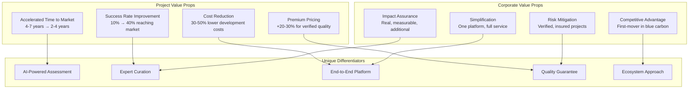
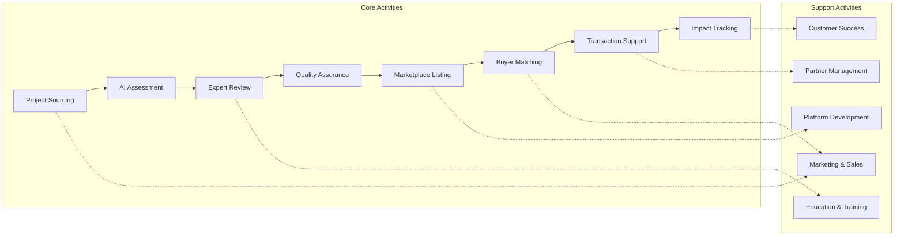

# Business Model Canvas - Athena Blue

## Visual Canvas Overview

### BUSINESS MODEL CANVAS: ATHENA BLUE
**Blue Carbon Marketplace & Accelerator**

---

| **KEY PARTNERS** | **KEY ACTIVITIES** | **VALUE PROPOSITIONS** | **CUSTOMER RELATIONSHIPS** | **CUSTOMER SEGMENTS** |
|------------------|-------------------|------------------------|----------------------------|----------------------|
| **Carbon Registries** • Verra • Gold Standard  **Validators & Verifiers**  **Financial Institutions**  **Insurance Providers**  **Tech Partners** • Monitoring tech  **Grant Providers** • EU Funds • Foundations  **Scientific Advisors**  **NGOs & Foundations**  **Government Agencies** | **Core Operations** • AI Assessment Development • Expert Review Coordination • Marketplace Curation • Quality Assurance • Transaction Facilitation  **Support Functions** • Impact Tracking • Relationship Management • Education & Training • Data Analytics • Compliance Support | **FOR PROJECTS:** • Accelerated path to market • Reduced costs & complexity • Access to buyers & funding • Expert guidance  **FOR CORPORATES:** • Verified quality • Simplified procurement • Risk mitigation • Impact stories | **PROJECTS:** • Guided onboarding • Expert mentorship • Community support  **CORPORATES:** • Dedicated account mgmt • Self-service platform • Education & training • Success partnership | **PROJECTS:** • Early stage (concept) • Development stage • Operational projects  **CORPORATES:** • Large corps (>€1B revenue) • SMEs • Sustainability leaders • Compliance driven |

---

| **KEY RESOURCES** | **CHANNELS** | **COST STRUCTURE** |
|-------------------|--------------|-------------------|
| **Technology** • AI/ML Platform • Tech Infrastructure  **Human Capital** • Expert Network • Core Team  **Intangible Assets** • Brand & Reputation • Data & Insights • Regulatory Knowledge  **Network Assets** • Project Pipeline • Buyer Network • Partnerships | **PROJECTS:** • Direct sales • Partner referrals • Content marketing • Events & conferences  **CORPORATES:** • Direct sales • Digital marketing • Industry events • Thought leadership • Partner channels | **FIXED COSTS:** • Platform development & maintenance • Core team salaries • Legal & compliance • Office & operations  **VARIABLE COSTS:** • Customer acquisition • Expert review fees • Transaction processing • Partner commissions • Marketing campaigns • Registry fees  **UNIT ECONOMICS:** • CAC Project: €500-2000 • CAC Corporate: €5000-15000 • LTV Project: €10000-50000 • LTV Corporate: €50000-500000 • Gross Margin: 40-60% |

---

| **REVENUE STREAMS** |
|-------------------|
| **TRANSACTION-BASED:** • Credit sales commission (10-15% of transaction) • Assessment fees (€500-2000/project) • Success fees • Advisory services • Verification support  **RECURRING:** • Platform subscriptions • Premium features • Data & analytics • Maintenance & support  **POTENTIAL FUTURE:** • Athena Blue Fund management • Insurance products • Carbon futures trading |

## Detailed Component Analysis

### 1. Customer Segments

#### Projects Segment (Supply Side)
| Segment | Size | Characteristics | Lifetime Value | Priority |
|---------|------|-----------------|----------------|----------|
| **Early Stage** | ~500 in Europe | • Concept/feasibility phase • Need maximum support • High failure rate (90%) • Long development time | €5,000-15,000 | Medium |
| **Development Stage** | ~100 in Europe | • Site secured, methodology work • Need technical support • Medium failure rate (50%) • 2-3 year timeline | €15,000-35,000 | High |
| **Operational** | ~20 in Europe | • Generating credits • Need sales/marketing • Low failure rate (10%) • Immediate revenue | €25,000-100,000 | Very High |
| **Scale Players** | ~5 in Europe | • Multiple sites • Sophisticated needs • Strategic partners • Large volumes | €100,000-500,000 | Strategic |

#### Corporate Segment (Demand Side)
| Segment | Size | Characteristics | Lifetime Value | Priority |
|---------|------|-----------------|----------------|----------|
| **Fortune 500** | ~200 targets | • Large budgets (>€1M/yr) • Complex requirements • Long sales cycles • High service needs | €250,000-2,000,000 | Very High |
| **Mid-Market** | ~2000 targets | • Growing budgets (€100-500k) • Faster decisions • Innovation focused • Relationship driven | €50,000-250,000 | High |
| **SME Leaders** | ~5000 targets | • Small budgets (<€100k) • Simple needs • Price sensitive • Self-service preference | €10,000-50,000 | Medium |
| **Public Sector** | ~100 targets | • Policy driven • Tender processes • Long cycles • Stable contracts | €100,000-500,000 | Medium |

### 2. Value Propositions

#### Core Value Creation

### 3. Channels

#### Channel Effectiveness Matrix
| Channel                   | Projects CAC | Corporates CAC | Conversion Rate | Scale Potential |
| ------------------------- | ------------ | -------------- | --------------- | --------------- |
| **Direct Sales**          | €2,000       | €15,000        | 25%             | Medium          |
| **Digital Marketing**     | €500         | €5,000         | 5%              | High            |
| **Partner Referrals**     | €200         | €2,000         | 40%             | High            |
| **Content Marketing**     | €300         | €3,000         | 10%             | Very High       |
| **Events/Conferences**    | €1,500       | €8,000         | 20%             | Medium          |
| **PR/Thought Leadership** | €400         | €4,000         | 15%             | High            |

### 4. Customer Relationships

#### Relationship Strategy by Segment
| Segment | Relationship Type | Touch Points | Investment | Retention Impact |
|---------|------------------|--------------|------------|------------------|
| **Early Projects** | Community-based | Monthly webinars, forums | Low | Medium |
| **Active Projects** | Guided support | Weekly check-ins, expert access | Medium | High |
| **Operational Projects** | Strategic partnership | Dedicated support, co-marketing | High | Very High |
| **Large Corporates** | White-glove service | Account manager, quarterly reviews | Very High | Very High |
| **Mid-Market** | Hybrid support | Self-service + expert help | Medium | High |
| **SMEs** | Digital-first | Platform, automated support | Low | Medium |

### 5. Revenue Streams

#### Revenue Model Analysis
| Stream | Current Status | Year 1 Target | Year 3 Target | Margin | Growth Rate |
|--------|---------------|---------------|---------------|--------|-------------|
| **Transaction Commission** | Pilot phase | €500k | €5M | 60% | 200% YoY |
| **Assessment Fees** | Active | €100k | €500k | 70% | 100% YoY |
| **Platform Subscriptions** | Planning | €200k | €2M | 80% | 150% YoY |
| **Advisory Services** | Opportunistic | €50k | €300k | 40% | 100% YoY |
| **Data Products** | Future | €0 | €200k | 90% | New in Y2 |
| **Financial Products** | Future | €0 | €500k | 30% | New in Y2 |

### 6. Key Resources

#### Resource Priority Matrix
| Resource | Critical Level | Current State | Investment Needed | ROI Timeline |
|----------|---------------|---------------|-------------------|--------------|
| **AI/ML Platform** | Critical | MVP built | €500k-1M | 12 months |
| **Expert Network** | Critical | 5 experts | €200k/year | Immediate |
| **Brand/Trust** | Critical | Building | €300k marketing | 18 months |
| **Project Pipeline** | Critical | 20 projects | €200k BD | 6 months |
| **Buyer Network** | Critical | 10 buyers | €500k sales | 9 months |
| **Tech Infrastructure** | Important | Basic | €200k | 12 months |
| **Data Assets** | Important | Limited | €100k | 24 months |
| **Partnerships** | Important | Few | €150k BD | 12 months |

### 7. Key Activities

#### Activity Value Chain

### 8. Key Partnerships

#### Partnership Strategy
| Partner Type | Strategic Value | Current Status | Action Required | Priority |
|-------------|----------------|----------------|-----------------|----------|
| **Registries** | Market access | Initial contact | Formal agreements | Critical |
| **Validators** | Quality assurance | None | Partner program | High |
| **Banks/Investors** | Capital access | Discussions | Product development | High |
| **Insurers** | Risk mitigation | Research phase | Product design | Medium |
| **Tech Partners** | Capability extension | Some integration | Deep integration | Medium |
| **Grant Providers** | Project funding | Ad hoc | Systematic approach | High |
| **Scientific Network** | Credibility | Informal | Advisory board | High |

### 9. Cost Structure

#### Cost Breakdown & Optimization
| Cost Category | Year 1 | Year 3 | % of Revenue | Optimization Strategy |
|--------------|--------|--------|--------------|----------------------|
| **Technology** | €400k | €800k | 20% | Automation, efficiency |
| **Team** | €600k | €2M | 35% | Performance-based comp |
| **Marketing** | €300k | €1M | 20% | Digital-first, content |
| **Operations** | €200k | €500k | 10% | Process optimization |
| **Expert Fees** | €150k | €400k | 8% | In-house capability |
| **Legal/Compliance** | €100k | €200k | 4% | Standardization |
| **Other** | €50k | €150k | 3% | Careful management |
| **Total** | €1.8M | €5.05M | 100% | 40-60% gross margin |

## Strategic Implications

### Competitive Advantages
1. **First-Mover:** Leading position in European blue carbon
2. **Technology:** AI-powered assessment unique in market
3. **Network Effects:** Two-sided marketplace dynamics
4. **Quality Mark:** "Athena Blue Verified" becomes standard
5. **Ecosystem:** Only end-to-end platform

### Growth Levers
1. **Geographic Expansion:** Spain → EU → Global
2. **Product Extension:** Credits → Futures → Fund
3. **Vertical Integration:** Assessment → Development → Management
4. **Horizontal Expansion:** Seagrass → All blue carbon → Nature-based

### Risk Factors
1. **Market Risk:** Blue carbon market slower than expected
2. **Methodology Risk:** Viable methodologies take longer to develop than anticipated
3. **Regulatory Risk:** Changes in carbon accounting rules
4. **Competition Risk:** Large players enter market
5. **Technology Risk:** AI doesn't deliver expected value
6. **Execution Risk:** Team/scaling challenges

### Success Metrics
- **Year 1:** 50 projects, 20 corporates, €1M revenue
- **Year 3:** 200 projects, 100 corporates, €10M revenue
- **Year 5:** 500 projects, 300 corporates, €50M revenue, breakeven