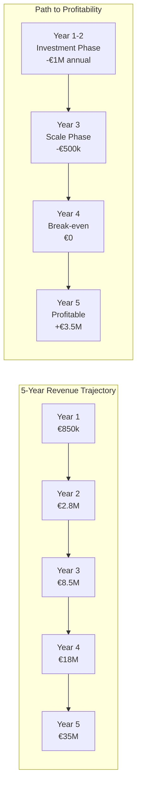

# Revenue & Cost Model Analysis - Athena Blue

## Executive Summary Financial Projections



## Detailed Revenue Model

### Revenue Stream Breakdown

| Revenue Stream | Year 1 | Year 2 | Year 3 | Year 4 | Year 5 | CAGR |
|---------------|--------|--------|--------|--------|--------|------|
| **Transaction Commissions** | €300k | €1.2M | €4.5M | €10M | €20M | 185% |
| **Assessment Fees** | €100k | €300k | €600k | €1M | €1.5M | 72% |
| **Platform Subscriptions** | €150k | €500k | €1.5M | €3M | €5M | 141% |
| **Advisory Services** | €100k | €300k | €800k | €1.5M | €2.5M | 122% |
| **Data & Intelligence** | €0 | €100k | €400k | €1M | €2M | 173% |
| **Financial Products** | €0 | €200k | €700k | €1.5M | €4M | 183% |
| **Grant Success Fees** | €200k | €200k | €0 | €0 | €0 | -100% |
| **Total Revenue** | **€850k** | **€2.8M** | **€8.5M** | **€18M** | **€35M** | **155%** |

### Transaction Commission Model

```
Average Transaction Size × Number of Transactions × Commission Rate = Revenue

Year 1: €50,000 × 40 × 15% = €300,000
Year 3: €75,000 × 400 × 15% = €4,500,000  
Year 5: €100,000 × 1,333 × 15% = €20,000,000
```

### Subscription Model Tiers

| Tier | Monthly Price | Features | Year 1 Target | Year 5 Target |
|------|--------------|----------|---------------|---------------|
| **Project Basic** | €100 | Platform access, basic tools | 50 | 200 |
| **Project Pro** | €500 | + Expert hours, priority support | 20 | 150 |
| **Corporate Basic** | €1,000 | Marketplace access, reporting | 10 | 100 |
| **Corporate Pro** | €5,000 | + Advisory, custom reports | 5 | 50 |
| **Enterprise** | €15,000+ | Full service, dedicated team | 1 | 20 |

### Unit Economics Analysis

#### Project Side (Supply)
```
Customer Acquisition Cost (CAC): €1,500
Lifetime Value (LTV): €25,000
LTV/CAC Ratio: 16.7x
Payback Period: 4 months
Gross Margin: 65%
Churn Rate: 15% annual
```

#### Corporate Side (Demand)
```
Customer Acquisition Cost (CAC): €8,000
Lifetime Value (LTV): €150,000
LTV/CAC Ratio: 18.8x
Payback Period: 3 months
Gross Margin: 70%
Churn Rate: 20% annual
```

## Detailed Cost Model

### Cost Structure Evolution

| Cost Category | Year 1 | Year 2 | Year 3 | Year 4 | Year 5 | % of Rev Y5 |
|--------------|--------|--------|--------|--------|--------|-------------|
| **Personnel** | €600k | €1.2M | €2.5M | €4M | €6M | 17% |
| **Technology** | €400k | €600k | €800k | €1.2M | €1.8M | 5% |
| **Marketing & Sales** | €300k | €600k | €1.5M | €2.5M | €4M | 11% |
| **Operations** | €200k | €400k | €800k | €1.5M | €2.5M | 7% |
| **Expert Network** | €150k | €300k | €600k | €1M | €1.5M | 4% |
| **Legal & Compliance** | €100k | €150k | €250k | €400k | €600k | 2% |
| **Office & Admin** | €50k | €100k | €200k | €300k | €500k | 1% |
| **Registry & Partners** | €50k | €150k | €400k | €900k | €1.6M | 5% |
| **Total Costs** | **€1.85M** | **€3.5M** | **€7.05M** | **€11.8M** | **€18.5M** | **53%** |
| **EBITDA** | **-€1M** | **-€700k** | **€1.45M** | **€6.2M** | **€16.5M** | **47%** |

### Personnel Plan

| Role | Year 1 | Year 2 | Year 3 | Year 4 | Year 5 | Avg Salary |
|------|--------|--------|--------|--------|--------|------------|
| **Executive Team** | 2 | 3 | 4 | 5 | 6 | €120k |
| **Tech/Product** | 3 | 6 | 10 | 15 | 20 | €80k |
| **Sales/BD** | 2 | 5 | 10 | 15 | 25 | €70k + comm |
| **Operations** | 2 | 4 | 8 | 12 | 18 | €60k |
| **Expert Reviewers** | 1 | 3 | 5 | 8 | 12 | €90k |
| **Marketing** | 1 | 3 | 5 | 8 | 12 | €65k |
| **Support** | 1 | 2 | 5 | 10 | 15 | €45k |
| **Total Headcount** | **12** | **26** | **47** | **73** | **108** | |

### Customer Acquisition Cost (CAC) Breakdown

#### Projects CAC Components
| Component | Cost | % of Total |
|-----------|------|------------|
| Digital marketing | €400 | 27% |
| Content creation | €300 | 20% |
| Events/conferences | €350 | 23% |
| Sales team time | €250 | 17% |
| Partner commissions | €200 | 13% |
| **Total Project CAC** | **€1,500** | **100%** |

#### Corporate CAC Components
| Component | Cost | % of Total |
|-----------|------|------------|
| Direct sales | €3,000 | 38% |
| Digital marketing | €1,500 | 19% |
| Events/conferences | €2,000 | 25% |
| Content/thought leadership | €1,000 | 12% |
| Partner referrals | €500 | 6% |
| **Total Corporate CAC** | **€8,000** | **100%** |

## Scenario Analysis

### Base Case (Most Likely)
```
Year 5 Metrics:
- Revenue: €35M
- EBITDA: €16.5M (47% margin)
- Projects: 500 active (assumes methodologies available by Year 2-3)
- Corporates: 300 active
- Market Share: 25% of European blue carbon
Note: Assumes UK methodology operational Year 2, other countries Year 3-4
```

### Bull Case (Optimistic)
```
Year 5 Metrics:
- Revenue: €60M (+71% vs base)
- EBITDA: €30M (50% margin)
- Projects: 800 active
- Corporates: 500 active
- Market Share: 40% of European blue carbon
Key Drivers: Faster market growth, regulatory tailwinds, successful geographic expansion
```

### Bear Case (Conservative)
```
Year 5 Metrics:
- Revenue: €18M (-49% vs base)
- EBITDA: €5M (28% margin)
- Projects: 250 active
- Corporates: 150 active
- Market Share: 15% of European blue carbon
Key Risks: Slower adoption, increased competition, regulatory challenges
```

## Funding Requirements

### Capital Needs by Stage

| Stage | Amount | Use of Funds | Expected Outcome |
|-------|--------|--------------|------------------|
| **Seed** (Now) | €2M | • MVP completion<br>• Initial team<br>• First 20 projects<br>• Market validation | Product-market fit |
| **Series A** (Year 2) | €5M | • Scale platform<br>• Expand team to 30<br>• 100 projects<br>• Corporate sales | €3M ARR |
| **Series B** (Year 4) | €15M | • Geographic expansion<br>• Product extensions<br>• 300 projects<br>• Market leadership | €20M ARR |
| **Growth** (Year 6+) | €30M+ | • Global expansion<br>• M&A opportunities<br>• New products<br>• Market dominance | €100M ARR |

### Return on Investment

```
Seed Investment: €2M
Year 5 Valuation (10x revenue): €350M
Seed Stake (20%): €70M value
ROI: 35x in 5 years
IRR: 105%
```

## Key Financial Metrics

### SaaS Metrics Evolution

| Metric | Year 1 | Year 2 | Year 3 | Year 4 | Year 5 |
|--------|--------|--------|--------|--------|--------|
| **MRR** | €50k | €180k | €550k | €1.2M | €2.3M |
| **ARR** | €600k | €2.2M | €6.6M | €14M | €28M |
| **Gross Margin** | 45% | 55% | 65% | 70% | 72% |
| **Burn Rate** | €100k/mo | €80k/mo | €40k/mo | Break-even | Profitable |
| **Runway** | 20 months | 25 months | Infinite | Infinite | Infinite |
| **Growth Rate** | - | 230% | 200% | 112% | 94% |

### Marketplace Metrics

| Metric | Year 1 | Year 2 | Year 3 | Year 4 | Year 5 |
|--------|--------|--------|--------|--------|--------|
| **GMV** | €2M | €8M | €30M | €67M | €133M |
| **Take Rate** | 15% | 15% | 15% | 15% | 15% |
| **Active Projects** | 20 | 60 | 150 | 300 | 500 |
| **Active Buyers** | 10 | 40 | 120 | 250 | 400 |
| **Avg Transaction** | €50k | €60k | €75k | €90k | €100k |
| **Transactions/Year** | 40 | 133 | 400 | 744 | 1,333 |

## Risk-Adjusted Financial Model

### Revenue Risk Factors

| Risk Factor | Probability | Impact | Mitigation |
|------------|------------|--------|------------|
| **Market adoption slower** | 30% | -40% revenue | Diversify offerings, education |
| **Competition intensifies** | 40% | -25% revenue | First-mover advantage, quality |
| **Regulatory changes** | 20% | -30% revenue | Multiple methodologies, flexibility |
| **Technology challenges** | 25% | -20% revenue | Manual backup, partnerships |
| **Economic downturn** | 35% | -35% revenue | Essential service positioning |

### Cost Risk Factors

| Risk Factor | Probability | Impact | Mitigation |
|------------|------------|--------|------------|
| **Talent acquisition** | 50% | +30% personnel | Remote work, equity comp |
| **Technology complexity** | 40% | +40% tech costs | Phased development, MVPs |
| **Customer acquisition** | 45% | +50% CAC | Referral programs, content |
| **Regulatory compliance** | 30% | +100% legal | Proactive compliance, insurance |

## Investment Highlights

### Why Invest in Athena Blue

1. **Market Timing:** €1B+ blue carbon market emerging, 150% CAGR
2. **First Mover:** Leading position in European blue carbon marketplace
3. **Network Effects:** Two-sided marketplace with strong moats
4. **Scalable Model:** 70%+ gross margins at scale
5. **Impact & Returns:** Environmental impact with venture returns
6. **Team:** Domain expertise + tech capability
7. **Traction:** 20 projects, 10 corporates already engaged
8. **Exit Potential:** Strategic acquisition or IPO in 5-7 years

### Financial Summary

```
Investment Ask: €2M Seed Round
Pre-Money Valuation: €8M
Use of Funds: 40% Tech, 30% Team, 20% Marketing, 10% Operations
Milestones: 50 projects, 25 corporates, €1M ARR in 18 months
Next Round: €5M Series A at €25M+ valuation in 18-24 months
Exit Horizon: 5-7 years at 10-15x revenue multiple
Expected Return: 30-50x for seed investors
```