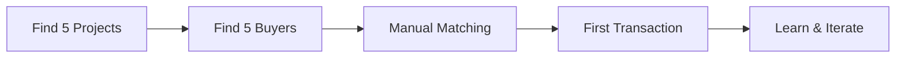

# The Lean Path: Year 1 Survival & Validation Roadmap

## Reality Check: Our Actual Resources

### Team Capacity
- **1 Full-Time:** CEO/Founder (you)
- **3 Part-Time:** ~60 hours/week combined
- **Total Capacity:** ~100 hours/week
- **Budget:** SEIS round (targeting £150k)
- **Runway:** 12-18 months

### What We're NOT Doing in Year 1
❌ Building sophisticated AI assessment engine  
❌ Creating a full marketplace platform  
❌ Trying to serve all of Europe  
❌ Developing our own methodology  
❌ Competing with established carbon platforms  
❌ Hiring a large team  

### What We ARE Doing: The 80/20 Approach
✅ Manually matching 5 projects with 5 buyers  
✅ Learning what both sides actually need  
✅ Building trust and reputation  
✅ Generating initial revenue  
✅ Proving the model works  

## The Three-Phase Lean Strategy

### Phase 1: Manual Concierge MVP (Months 1-4)
**Goal: Prove demand exists and learn deeply**

| Week            | Priority Action                | Owner | Success Metric             | Cost          |
| --------------- | ------------------------------ | ----- | -------------------------- | ------------- |
| **Weeks 1-2**   | Close SEIS round               | CEO   | £150k secured              | £5k legal     |
| **Weeks 3-4**   | Identify 20 potential projects | CEO   | 20 qualified leads         | £500 travel   |
| **Weeks 5-8**   | Deep dive with 5 best projects | Team  | 5 signed LOIs              | £2k travel    |
| **Weeks 9-12**  | Approach 20 corporate buyers   | CEO   | 20 qualified conversations | £2k marketing |
| **Weeks 13-16** | Match first project-buyer pair | Team  | 1 signed pre-purchase      | £1k legal     |

**Key Activities:**
- **Project Work (40% time):** Visit sites, understand challenges, document needs
- **Buyer Work (40% time):** Executive meetings, understand requirements, build trust
- **Matching (20% time):** Spreadsheets, calls, introductions

**What We'll Learn:**
- Real project pain points (beyond our assumptions)
- Actual buyer requirements (not what they say publicly)
- Price points that work
- Deal breakers we didn't know existed

### Phase 2: Productize the Service (Months 5-8)
**Goal: Systematize what works, drop what doesn't**

| Month | Build | Validate | Revenue Target |
|-------|-------|----------|----------------|
| **Month 5** | Simple assessment checklist | Test with 3 projects | First commission (£5k) |
| **Month 6** | Buyer requirements template | Test with 3 buyers | Second transaction (£10k) |
| **Month 7** | Basic matching algorithm (spreadsheet) | 5 matches made | Third transaction (£15k) |
| **Month 8** | Simple website with case studies | 10 new leads | Total £30k revenue |

**Tech Stack (Keep it Simple):**
- **Website:** Webflow or Squarespace (£50/month)
- **CRM:** Airtable (£20/month)
- **Communication:** WhatsApp + Zoom
- **Payments:** Stripe (2.9% fees)
- **Documents:** Google Workspace

**Team Allocation:**
- **CEO (FT):** Sales, partnerships, fundraising
- **Part-time 1 (20h):** Project support, documentation
- **Part-time 2 (20h):** Buyer support, marketing
- **Part-time 3 (20h):** Operations, finance, admin

### Phase 3: Build for Scale (Months 9-12)
**Goal: Prepare for Series A with proven model**

**Only Now Do We Build:**
- Basic platform (outsourced dev: £20k)
- Automated assessment flow
- Marketplace prototype
- Data room for investors

**Metrics to Hit:**
- 10 active projects
- 10 committed buyers
- £100k total revenue
- 3 completed transactions
- 90% customer satisfaction

## The Methodology Reality: Our Pragmatic Approach

### We're NOT Solving the Methodology Problem
That's a £15M, 3-year challenge. We don't have the resources.

### We ARE Working Around It
1. **UK First:** Partner with UK projects using their emerging methodology
2. **Pre-Sales:** Help Spanish projects pre-sell future credits to fund methodology development
3. **Consortium Catalyst:** Facilitate, don't fund, methodology development
4. **Data Broker:** Connect projects needing data with universities needing research sites

## Critical Success Factors for Year 1

### The Only 5 KPIs That Matter

| KPI | Q1 Target | Q2 Target | Q3 Target | Q4 Target |
|-----|-----------|-----------|-----------|-----------|
| **Projects Signed** | 2 | 5 | 8 | 10 |
| **Buyers Committed** | 1 | 3 | 7 | 10 |
| **Revenue** | £0 | £10k | £40k | £100k |
| **Completed Transactions** | 0 | 1 | 2 | 3 |
| **Cash Remaining** | £140k | £110k | £70k | £50k |

### The "Hell Yes" Filter
Every opportunity must pass this test:
1. Can we execute with current team? (No hiring required)
2. Will it generate revenue or learning in <3 months?
3. Does it move us toward product-market fit?
4. Can we afford to fail at it?

If not 4x "Yes" → Say No

## Budget Allocation: Every Pound Counts

### Year 1 Budget (£150k SEIS)

| Category                 | Amount | %   | Details                                |
| ------------------------ | ------ | --- | -------------------------------------- |
| **Salaries**             | £60k   | 40% | CEO modest salary + part-time team     |
| **Operations**           | £20k   | 13% | Travel, meetings, site visits          |
| **Technology**           | £15k   | 10% | Basic tools, website, initial platform |
| **Marketing**            | £10k   | 7%  | Content, events, PR                    |
| **Legal/Compliance**     | £10k   | 7%  | Contracts, regulations, insurance      |
| **Platform Development** | £20k   | 13% | Outsourced MVP (Month 9+)              |
| **Reserve**              | £15k   | 10% | Emergency buffer                       |

### Revenue Model: Simple & Clear

**Year 1 Revenue Streams:**
1. **Transaction Commission:** 10% of credit sales (£50-100k target)
2. **Success Fees:** £5k per matched pair (£25k target)
3. **Advisory:** Opportunistic consulting (£25k target)

**NOT Year 1:** Subscriptions, data products, complex financial products

## The Path to Series A

### What We Need to Prove
1. **Problem-Solution Fit:** Projects and buyers actively engage
2. **Business Model:** We can make money matching them
3. **Scalability:** Process can be systematized
4. **Market Size:** Enough projects/buyers for VC-scale business

### Series A Readiness Checklist
- [ ] £100k+ annual revenue run rate
- [ ] 10+ active projects
- [ ] 10+ committed buyers
- [ ] 3+ completed transactions
- [ ] Documented playbooks
- [ ] Basic technology platform
- [ ] Clear path to £10M revenue

## Risk Mitigation: What Could Kill Us

| Risk | Probability | Impact | Mitigation |
|------|------------|--------|------------|
| **No methodology = No credits** | High | Fatal | Focus on UK first, pre-sales for others |
| **Projects fail** | Medium | High | Portfolio approach, strict vetting |
| **Buyers don't buy** | Medium | Fatal | Get LOIs early, start with believers |
| **Run out of money** | Medium | Fatal | Revenue focus, extend runway, raise bridge |
| **Team burnout** | High | High | Realistic goals, celebrate small wins |

## The Daily Reality: What Success Looks Like

### Month 1
- 3 project site visits completed
- 10 buyer conversations started
- Basic website live
- First team member onboarded

### Month 3
- 5 projects signed
- 3 buyers seriously engaged
- First match attempted
- £10k revenue pipeline

### Month 6
- First transaction completed
- £30k revenue achieved
- 10 projects in pipeline
- Basic systems documented

### Month 9
- 3 transactions done
- £70k revenue to date
- Platform MVP in development
- Series A conversations started

### Month 12
- £100k+ revenue achieved
- 10 active projects
- 10 committed buyers
- Series A term sheet

## The Hard Truths

### What Will Actually Happen
- **70% of projects** will move slower than expected
- **50% of buyers** will ghost after showing interest
- **First transaction** will take 2x longer than planned
- **Technology** will break at the worst moment
- **You'll pivot** at least twice

### Why We'll Succeed Anyway
1. **We're solving a real problem** - Projects need buyers, buyers need projects
2. **We're starting manual** - No tech risk, pure value delivery
3. **We're revenue-focused** - Every decision drives toward revenue
4. **We're methodology-agnostic** - Work with what exists, not what should exist
5. **We're lean** - Can survive on fumes while others burn millions

## The One-Page Plan

### Vision
Become the trusted connector in European blue carbon.

### Year 1 Mission
Manually facilitate 3+ blue carbon transactions while learning what to build.

### Strategy
1. Start with UK (methodology ready)
2. Manual everything (concierge MVP)
3. Revenue from Day 1 thinking
4. Build only what's validated
5. Raise Series A on traction, not promises

### Q1: Learn
- Sign 5 projects
- Engage 3 buyers
- Zero revenue OK

### Q2: Validate
- First transaction
- £10k revenue
- Document what works

### Q3: Systematize
- 2+ transactions
- £40k cumulative revenue
- Build basic tools

### Q4: Scale Prep
- 3+ transactions
- £100k cumulative revenue
- Raise Series A

### Resources
- £150k SEIS round
- 4 people (1 FT, 3 PT)
- 12-month runway

### Success Metrics
- 3 completed transactions
- £100k revenue
- 10 projects + 10 buyers
- Series A ready

## The Commitment

This is not the grand vision from our other documents. This is survival mode. This is about proving that Athena Blue should exist before building Athena Blue.

Every decision through one lens: **Will this help us complete our first 3 transactions?**

If yes, do it.  
If no, park it for Year 2.  
If maybe, the answer is no.

The lean path isn't pretty, but it's real. And in startups, real beats perfect every time.