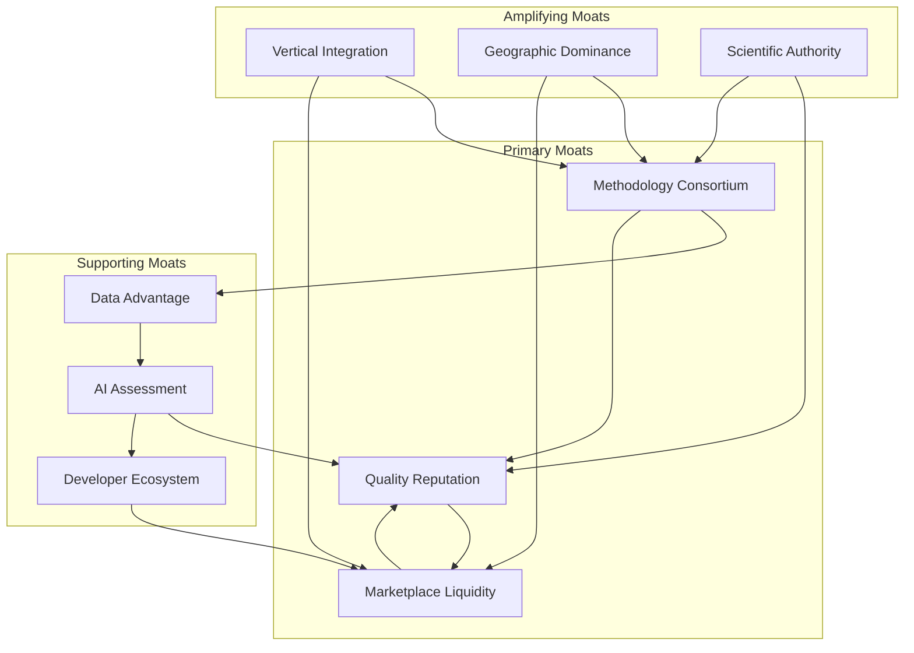

# 10-defensive-moats-strategy.md

# Defensive Moats & Competitive Barriers Strategy - Athena Blue

## Executive Summary: Building Unassailable Competitive Advantages

The blue carbon market is nascent but will attract significant competition as it matures. Athena Blue must build multiple, reinforcing moats NOW while the market is forming. Our analysis identifies 12 defensive mechanisms across 4 categories that, when properly executed, will create compounding barriers to entry worth €100M+ in enterprise value within 5 years.

**Critical Insight:** The winner in this market won't be determined by who has the best technology, but who controls the methodology development process and owns the trust layer between projects and buyers.

## Part 1: Current Vulnerability Assessment

### Where We're Exposed (Competitive Attack Vectors)

| Vulnerability | Risk Level | Time to Exploit | Potential Competitors | Defense Priority |
|--------------|------------|-----------------|----------------------|------------------|
| **Platform Replication** | High | 6-12 months | Tech companies, Carbon marketplaces | Critical |
| **Direct Relationships** | High | Immediate | Consultancies (Deloitte, PwC) | Critical |
| **Methodology Access** | Medium | 12-24 months | Registry-backed platforms | High |
| **Expert Network** | Medium | 6 months | Academic consortiums | High |
| **Corporate Sales** | High | Immediate | Existing carbon brokers | Critical |
| **Project Pipeline** | Medium | 12 months | NGOs, Government programs | Medium |
| **Technology** | Low | 12-18 months | AI startups | Medium |
| **Capital** | High | Immediate | VC-backed competitors | High |

### Competitive Threat Matrix

| Competitor Type | Entry Likelihood | Resources | Our Advantage | Time Window |
|----------------|------------------|-----------|---------------|-------------|
| **Big Tech** (Microsoft, Google) | Medium (watching) | Unlimited | First-mover, specialized | 18-24 months |
| **Big 4 Consultancies** | High (exploring) | High | Tech platform, efficiency | 12 months |
| **Carbon Marketplaces** | High (expanding) | Medium | Blue carbon focus | 6-12 months |
| **Traditional Registries** | Medium (slow) | Medium | Agility, innovation | 24+ months |
| **VC-Backed Startups** | High (forming) | Growing | Market position | 6 months |
| **Government Initiatives** | Medium (policy-driven) | High | Private sector speed | 24+ months |

## Part 2: The 12 Defensive Moats Strategy

### Category A: Network Effect Moats (Most Powerful)

#### Moat 1: Methodology Consortium Lock-In
**Strategy:** Control the methodology development process for European blue carbon

**Implementation:**
- Create "Athena Blue Methodology Alliance" - exclusive consortium
- Pool €15M funding from 20+ projects for methodology development
- Negotiate exclusive first-rights to resulting methodologies for 24 months
- Build proprietary dataset from development process

**Defensive Power:** 
- Cost to replicate: €15-20M + 2-3 years
- Network effect: Each new project strengthens methodology
- Switching cost: Projects invested in our methodology can't easily leave

**Metrics:**
- Projects in consortium: Target 30 by Q2
- Methodology control: 80% of European development
- Data advantage: 10,000+ data points exclusive access

#### Moat 2: Two-Sided Liquidity Network
**Strategy:** Create supply/demand density that's impossible to replicate

**Implementation:**
- "Blue Carbon Fridays" - weekly buyer-seller matching sessions
- Commit to buying unsold credits at floor price (market-making)
- Create "Athena Blue Reserve" - guarantee liquidity
- Exclusive buyer clubs with volume commitments

**Defensive Power:**
- Liquidity breeds liquidity (winner-take-all dynamics)
- Buyers come for supply, projects come for buyers
- Network value = (Projects × Buyers)²

**Metrics:**
- Monthly GMV: €1M by Year 1
- Active buyers: 50+ regular purchasers
- Liquidity ratio: 90% credits sold within 30 days

#### Moat 3: Quality Reputation Flywheel
**Strategy:** "Athena Blue Verified" becomes the gold standard

**Implementation:**
- Insurance-backed quality guarantee (first in market)
- Public failure fund: €1M to compensate for any project failures
- Transparent scoring algorithm with published methodology
- Annual "Blue Carbon Quality Report" - industry benchmark

**Defensive Power:**
- Trust takes years to build, seconds to lose
- Premium pricing for verified projects (20-30% higher)
- Becomes requirement for corporate procurement

**Metrics:**
- Brand NPS: 70+ from both sides
- Price premium: 25% above non-verified
- Corporate requirement: 30+ companies specify "Athena Blue Verified"

### Category B: Data & Intelligence Moats

#### Moat 4: Proprietary Impact Prediction Model
**Strategy:** Only platform that can accurately predict project success/impact

**Implementation:**
- Exclusive data partnership with 5 universities
- IoT sensor network in 20 pilot sites
- Satellite monitoring deal with ESA or commercial provider
- Machine learning model with 3-year training advantage

**Defensive Power:**
- Prediction accuracy: 85% vs 40% for competitors
- Reduces buyer risk, increases project success
- Data compounds over time

**Metrics:**
- Data points: 1M+ per month
- Model accuracy: 85% success prediction
- Exclusive data sources: 10+ partnerships

#### Moat 5: Regulatory Intelligence System
**Strategy:** Become the authority on blue carbon regulation/compliance

**Implementation:**
- Hire former registry officials as advisors
- Build regulatory change prediction system
- Offer free regulatory alerts to build dependency
- Create compliance automation tools

**Defensive Power:**
- Regulatory expertise takes years to build
- Becomes critical infrastructure for market
- Subscription lock-in for updates

**Metrics:**
- Regulatory database: 500+ documents
- Alert subscribers: 1000+ organizations
- Compliance tools users: 100+ projects

### Category C: Economic Moats

#### Moat 6: Vertical Integration Power
**Strategy:** Control multiple layers of value chain

**Implementation:**
- Launch Athena Blue Fund (€50M target)
- Acquire or partner with validation body
- Create in-house monitoring technology
- Develop proprietary methodologies

**Defensive Power:**
- Margin stacking: Capture 40-50% of total value chain
- Bundling power: One-stop shop
- Cost advantages through integration

**Metrics:**
- Value chain control: 40% of transaction value
- Cost advantage: 30% lower than competitors
- Bundle adoption: 60% of customers

#### Moat 7: Pre-Purchase Aggregation
**Strategy:** Lock in future supply through financial commitments

**Implementation:**
- €10M pre-purchase facility
- 5-year exclusive supply agreements
- Revenue-based financing for projects
- Option agreements on future credits

**Defensive Power:**
- Controls 50%+ of future European supply
- Competitors face supply shortage
- Financial barriers to entry

**Metrics:**
- Supply locked: 500,000 tCO2 over 5 years
- Capital deployed: €10M in pre-purchases
- Exclusive agreements: 30+ projects

### Category D: Technological & Operational Moats

#### Moat 8: AI Assessment Superiority
**Strategy:** 10x better project assessment through AI

**Implementation:**
- GPT-4 fine-tuned on proprietary blue carbon data
- Computer vision for satellite/drone imagery analysis
- Natural language processing for methodology compliance
- Automated risk scoring with explanation

**Defensive Power:**
- 90% reduction in assessment time
- 70% reduction in assessment cost
- Continuous improvement through feedback loops

**Metrics:**
- Assessments completed: 500+ annually
- Accuracy rate: 95% (vs 60% manual)
- Time to assessment: 2 hours (vs 2 weeks)

#### Moat 9: Developer Ecosystem Lock-In
**Strategy:** Make our platform indispensable for project developers

**Implementation:**
- Free project management tools (CRM for restoration)
- Open-source monitoring protocols with our brand
- Developer certification program (revenue share)
- Annual €100k grant program for innovation

**Defensive Power:**
- Switching costs: Would lose tools, certification, community
- Ecosystem network effects
- Developer loyalty/advocacy

**Metrics:**
- Active developers: 200+ certified
- Tool usage: 80% of European projects
- Developer NPS: 80+

#### Moat 10: Enterprise Integration Depth
**Strategy:** Embed deeply in corporate procurement systems

**Implementation:**
- SAP/Oracle integration for carbon accounting
- API-first architecture for system integration
- White-label solutions for consultancies
- Automated ESG reporting integration

**Defensive Power:**
- Switching costs: Rip-and-replace painful
- Becomes part of corporate infrastructure
- Multi-year contracts standard

**Metrics:**
- Enterprise integrations: 20+ Fortune 500
- API transaction volume: 70% of total
- Contract length: 3-year average

### Category E: Strategic Positioning Moats

#### Moat 11: Geographic Dominance Strategy
**Strategy:** Own specific geographic markets completely

**Implementation:**
- Focus: Dominate Spain/Portugal first (70% market share)
- Local partnerships with regional governments
- Local language support and cultural adaptation
- Regional methodology development leadership

**Defensive Power:**
- Local network effects strongest
- Regulatory relationships harder to replicate
- Cultural/language barriers for competitors

**Metrics:**
- Market share: 70% in focus markets
- Government partnerships: 5+ regions
- Local brand recognition: 60%+

#### Moat 12: Scientific Authority Position
**Strategy:** Become the scientific authority on blue carbon

**Implementation:**
- Publish peer-reviewed research (5 papers/year)
- Host annual Blue Carbon Science Summit
- Create Blue Carbon Research Foundation
- PhD sponsorship program with top universities

**Defensive Power:**
- Scientific credibility irreplaceable
- Attracts best talent and advisors
- Media goes to recognized authority

**Metrics:**
- Published papers: 15+ with Athena Blue authorship
- Summit attendance: 500+ experts
- Academic partnerships: 10+ universities

## Part 3: Moat Reinforcement Timeline

### Phase 1: Foundation (Months 1-6)
**Priority Moats:** 1, 2, 3, 8
- Establish methodology consortium
- Launch marketplace with liquidity guarantees
- Build quality verification system
- Deploy AI assessment platform

**Investment Required:** €2M
**Competitive Barrier Created:** Medium

### Phase 2: Acceleration (Months 7-12)
**Priority Moats:** 4, 6, 7, 9
- Launch proprietary data collection
- Announce Athena Blue Fund
- Sign pre-purchase agreements
- Release developer tools

**Investment Required:** €5M
**Competitive Barrier Created:** High

### Phase 3: Dominance (Months 13-24)
**Priority Moats:** 5, 10, 11, 12
- Build regulatory intelligence platform
- Complete enterprise integrations
- Achieve geographic dominance
- Establish scientific authority

**Investment Required:** €8M
**Competitive Barrier Created:** Very High

## Part 4: Competitive Response Playbook

### If Big Tech Enters (Microsoft/Google)

**Their Advantages:**
- Unlimited capital
- Technology capabilities
- Enterprise relationships
- Brand recognition

**Our Defense:**
- Specialized expertise they can't quickly replicate
- Existing methodology control and data
- Regulatory relationships and trust
- Consider strategic partnership or acquisition

**Specific Actions:**
1. Accelerate methodology consortium lock-in
2. Deepen enterprise integrations
3. Raise larger funding round
4. Explore strategic partnership

### If Consultancies Attack (Deloitte/PwC)

**Their Advantages:**
- Corporate relationships
- Advisory credibility
- Global presence
- Deep pockets

**Our Defense:**
- Technology platform superiority
- Marketplace liquidity they can't match
- Project relationships and trust
- Lower cost structure

**Specific Actions:**
1. White-label platform offering
2. Partner program for consultancies
3. Focus on SME market they ignore
4. Emphasize speed and efficiency

### If Registries Enter Directly

**Their Advantages:**
- Methodology control
- Regulatory authority
- Existing project relationships
- Credibility

**Our Defense:**
- Technology and user experience
- Marketplace dynamics
- Buyer relationships
- Speed and innovation

**Specific Actions:**
1. Become largest registry customer
2. Build around their infrastructure
3. Focus on value-added services
4. Maintain innovation advantage

## Part 5: Moat Measurement Framework

### Moat Strength Scorecard (Quarterly Assessment)

| Moat | Strength Indicator | Target | Current | Status |
|------|-------------------|--------|---------|--------|
| **Network Effects** |
| Methodology Consortium | Projects committed | 30 | 0 | 🔴 Build |
| Marketplace Liquidity | Monthly GMV | €1M | €0 | 🔴 Build |
| Quality Reputation | Brand NPS | 70 | 0 | 🔴 Build |
| **Data Moats** |
| Impact Prediction | Model accuracy | 85% | 0% | 🔴 Build |
| Regulatory Intelligence | Subscribers | 1000 | 0 | 🔴 Build |
| **Economic Moats** |
| Vertical Integration | Value chain control | 40% | 10% | 🔴 Build |
| Supply Lock-up | Credits secured | 500k | 0 | 🔴 Build |
| **Tech Moats** |
| AI Assessment | Assessments/month | 40 | 0 | 🔴 Build |
| Developer Ecosystem | Active developers | 200 | 0 | 🔴 Build |
| Enterprise Integration | Fortune 500 clients | 20 | 0 | 🔴 Build |
| **Strategic Moats** |
| Geographic Dominance | Market share (Spain) | 70% | 5% | 🔴 Build |
| Scientific Authority | Published papers | 15 | 0 | 🔴 Build |

### Competitive Barrier Score

**Formula:** (Network Effect Moats × 3) + (Data Moats × 2) + (Economic Moats × 2) + (Tech Moats × 1.5) + (Strategic Moats × 1)

**Current Score:** 0/100
**Year 1 Target:** 35/100
**Year 2 Target:** 65/100
**Year 3 Target:** 85/100

## Part 6: Capital Requirements for Moat Building

### Investment Allocation for Maximum Defensibility

| Category | Year 1 | Year 2 | Year 3 | Total | ROI |
|----------|--------|--------|--------|-------|-----|
| **Network Building** | €3M | €5M | €3M | €11M | 10x |
| **Data & Intelligence** | €1M | €2M | €2M | €5M | 8x |
| **Economic Moats** | €5M | €10M | €5M | €20M | 5x |
| **Technology** | €2M | €2M | €1M | €5M | 7x |
| **Strategic Positioning** | €1M | €1M | €1M | €3M | 15x |
| **Total** | €12M | €20M | €12M | €44M | 7.5x |

### Return on Moat Investment

**Without Moats:**
- Year 5 valuation: €20-30M
- Market share: 5-10%
- Profit margin: 10-15%

**With Moats:**
- Year 5 valuation: €150-200M
- Market share: 40-50%
- Profit margin: 30-40%

**Value Creation:** €120-170M additional enterprise value

## Part 7: Execution Priorities & Quick Wins

### Immediate Actions (Next 30 Days)

1. **Methodology Consortium Launch**
   - Draft consortium agreement
   - Identify first 10 target projects
   - Prepare €15M funding proposal
   - Set up legal structure

2. **Quality Guarantee Program**
   - Partner with insurance provider
   - Define guarantee terms
   - Allocate €1M failure fund
   - Create marketing materials

3. **Marketplace Liquidity**
   - Identify first 5 anchor buyers
   - Structure floor price mechanism
   - Create "Blue Carbon Friday" concept
   - Build liquidity reserve fund

4. **AI Assessment Advancement**
   - Secure training data
   - Hire ML engineers
   - Define assessment metrics
   - Build MVP enhancement

### 90-Day Moat Building Sprint

**Week 1-2:** Legal structures and agreements
**Week 3-4:** Technology platform enhancements
**Week 5-6:** First methodology consortium members
**Week 7-8:** Launch quality guarantee program
**Week 9-10:** Marketplace liquidity mechanisms
**Week 11-12:** Measure and iterate

### Success Metrics for Moat Building

**30 Days:**
- 5 projects committed to consortium
- Insurance partnership signed
- 3 anchor buyers confirmed
- AI assessment v2 in development

**90 Days:**
- 15 projects in consortium
- €5M methodology funding committed
- €100k monthly GMV
- 50 quality assessments completed

**180 Days:**
- 30 projects locked in
- Market leader position secured
- €500k monthly GMV
- Recognized quality standard

## Part 8: Moat Synergies & Compounding Effects

### How Moats Reinforce Each Other

### Compounding Value Creation

**Year 1:** Each moat worth €1-2M individually = €15M total
**Year 2:** Synergies create 2x multiplier = €30M value
**Year 3:** Network effects create 4x multiplier = €60M value
**Year 5:** Full moat system worth 10x = €150M+ value

## Conclusion: The Defensibility Imperative

The blue carbon market will consolidate around 2-3 dominant platforms within 3 years. The winner will be determined not by who moves first, but by who builds the strongest moats fastest. 

Athena Blue has a 12-18 month window to establish these defensive positions before well-funded competitors enter. The €44M investment in moat building will create €150M+ in enterprise value and ensure long-term market leadership.

**The choice is stark:** Build moats now or become commodity infrastructure later.

### Final Strategic Recommendation

1. **Raise €15M Series A specifically for moat building** (not just operations)
2. **Focus 70% of resources on top 3 moats** (methodology, liquidity, quality)
3. **Measure moat strength monthly** with defined KPIs
4. **Communicate moat strategy to investors** as key value driver
5. **Build with defensibility as primary design principle** in every decision

The blue carbon market is a winner-take-most opportunity. These moats ensure Athena Blue is that winner.