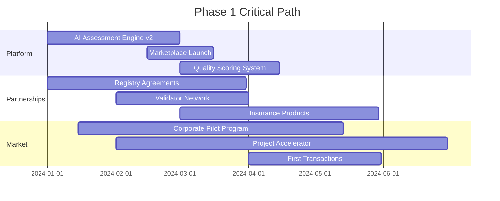
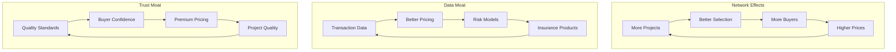
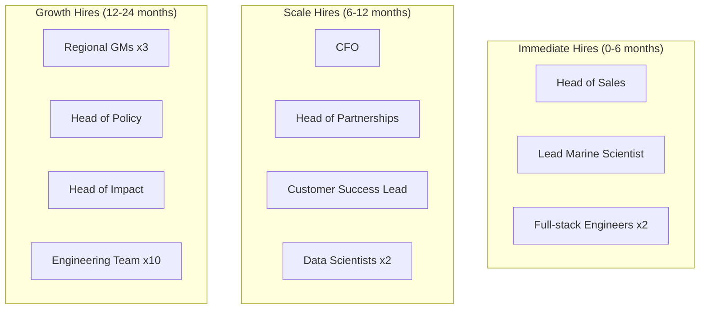

# Strategic Recommendations Playbook - Athena Blue

## Executive Strategic Summary

### Vision Statement
**"Become the trusted global infrastructure for blue carbon markets, accelerating ocean restoration while delivering measurable climate impact and financial returns."**

### Strategic Imperatives
1. **Dominate European Market** - Achieve 40% market share in 3 years
2. **Build Trust Infrastructure** - Become the "Moody's of Blue Carbon"
3. **Create Network Effects** - Lock in both sides of marketplace
4. **Expand Value Chain** - Move from marketplace to ecosystem
5. **Scale Globally** - Europe → Americas → Asia-Pacific

## Phase 1: Foundation (Months 1-6)
**Focus: Product-Market Fit & Trust Building**

### Immediate Actions (Month 1)

| Priority | Action | Owner | Success Metric | Investment |
|----------|--------|-------|----------------|------------|
| **1** | Launch "Athena Blue Verified" quality mark | Product | Brand recognition | €50k |
| **2** | Secure 3 flagship corporate buyers | Sales | €500k commitments | €20k |
| **3** | Onboard 10 mature projects | BD | Listed on platform | €30k |
| **4** | Form Scientific Advisory Board | CEO | 5 respected experts | €10k |
| **5** | Initiate methodology consortium | CEO | 5+ partners committed | €50k |
| **6** | Develop assessment AI v2 | Tech | 50% faster assessments | €100k |

### Critical Path Activities (Months 2-6)



### Key Decisions Required

1. **Pricing Strategy:** Premium positioning vs. volume play
   - **Recommendation:** Premium with 15% commission, dropping to 10% at scale
   
2. **Geographic Focus:** Spain only vs. Pan-European
   - **Recommendation:** UK + Spain Year 1 (UK has methodology progress), expand as methodologies develop
   
3. **Project Support Level:** Light touch vs. Heavy acceleration
   - **Recommendation:** Heavy support for 10 flagship projects
   
4. **Methodology Strategy:** Wait for others vs. Lead development
   - **Recommendation:** Co-lead consortium with corporate buyers sharing costs

## Phase 2: Scale (Months 7-18)
**Focus: Market Leadership & Network Effects**

### Growth Levers to Activate

| Lever | Implementation | Expected Impact | Timeline |
|-------|---------------|-----------------|----------|
| **Buyer Aggregation** | Form buyer coalition for bulk purchasing | 5x transaction volume | Months 7-9 |
| **Project Fund** | €5M fund for bridge financing | 30 new projects | Months 10-12 |
| **Insurance Bundle** | Packaged risk products | 50% price premium justified | Months 8-10 |
| **Automated Verification** | IoT/satellite monitoring | 70% cost reduction | Months 12-15 |
| **Carbon Futures** | Forward purchase agreements | 3x capital efficiency | Months 13-18 |

### Competitive Moat Building



### Partnership Strategy

| Partner Type | Target Partners | Value Exchange | Priority | Timeline |
|--------------|----------------|----------------|----------|----------|
| **Strategic Corporate** | Microsoft, Stripe, Shopify | Exclusive supply + co-innovation | Critical | Months 7-9 |
| **Financial Institution** | European Investment Bank | Capital + credibility | High | Months 8-10 |
| **Technology** | Planet Labs, Spire | Monitoring data + verification | High | Months 10-12 |
| **Development Org** | IUCN, WWF | Pipeline + credibility | Medium | Months 9-12 |
| **Government** | Spanish/EU Climate Ministry | Policy support + funding | Medium | Months 12-15 |

## Phase 3: Dominate (Months 19-36)
**Focus: Market Leadership & Expansion**

### Strategic Initiatives

#### Initiative 1: Vertical Integration
```
Current: Marketplace only
Future: Full stack provider

Components to Build/Buy:
- Project development arm (acquire small developer)
- Verification services (partner → acquire)
- Insurance products (JV with insurer)
- Monitoring technology (build or acquire)
- Policy/advocacy arm (build)
```

#### Initiative 2: Geographic Expansion
```
Year 2: Spain, Portugal, France, Italy
Year 3: UK, Netherlands, Germany, Greece
Year 4: US East Coast, Caribbean
Year 5: Southeast Asia, Australia
```

#### Initiative 3: Product Extensions
```
Core → Adjacent → Transformational

Core (Now):
- Seagrass credits
- Basic marketplace
- Assessment tools

Adjacent (Year 2-3):
- All blue carbon (mangroves, salt marshes)
- Project finance products
- Risk management tools
- Data/intelligence products

Transformational (Year 3-5):
- Biodiversity credits
- Ocean health marketplace
- Blue economy investment platform
- Climate risk analytics
```

## Strategic Options Analysis

### Option A: Pure Marketplace Play
**Strategy:** Focus solely on matching buyers and sellers
- **Pros:** Capital efficient, scalable, clear focus
- **Cons:** Limited differentiation, margin pressure, commodity risk
- **Verdict:** ❌ Too limiting

### Option B: Full Stack Platform
**Strategy:** Own entire value chain from development to retirement
- **Pros:** Higher margins, control quality, deeper moats
- **Cons:** Capital intensive, execution complexity, slower scale
- **Verdict:** ✅ **RECOMMENDED**

### Option C: Technology Licensing
**Strategy:** License platform to others, become infrastructure
- **Pros:** Highly scalable, low capital needs, global reach
- **Cons:** Less control, slower revenue, commoditization risk
- **Verdict:** ❌ Premature, consider Year 5+

## Risk Mitigation Strategies

### Top 5 Risks & Mitigations

| Risk | Probability | Impact | Mitigation Strategy | Owner |
|------|------------|--------|-------------------|-------|
| **Market develops slowly** | Medium | High | • Diversify into adjacent markets<br>• Reduce burn rate<br>• Focus on education | CEO |
| **Large competitor enters** | High | High | • Build network effects fast<br>• Lock in exclusive partnerships<br>• Focus on quality differentiation | CEO |
| **Regulatory changes** | Medium | Medium | • Multi-methodology approach<br>• Active policy engagement<br>• Geographic diversification | Legal |
| **Technology doesn't scale** | Low | High | • Manual backup processes<br>• Gradual automation<br>• Partnership options | CTO |
| **Project failures** | Medium | High | • Rigorous due diligence<br>• Insurance products<br>• Portfolio approach | Ops |

## Go-to-Market Strategy

### Three-Pronged Approach

#### 1. Project Acquisition (Supply)
```
Channel Strategy:
- Direct outreach to research institutions (40%)
- NGO partnerships (30%)
- Government programs (20%)
- Inbound/content (10%)

Value Proposition Pyramid:
Top Tier: "We'll make you successful"
- Dedicated support
- Guaranteed buyer
- Premium pricing

Mid Tier: "We'll make it easy"
- Simplified process
- Expert guidance
- Fair pricing

Entry Tier: "We'll make it possible"
- Free assessment
- Market access
- Basic support
```

#### 2. Corporate Acquisition (Demand)
```
Target Segmentation:
- Innovators: Tech companies, luxury brands (20%)
- Fast Followers: Financial services, retail (30%)
- Mainstream: Manufacturing, transport (40%)
- Laggards: Heavy industry (10%)

Sales Motion:
- Enterprise (>€1M): Direct sales, 6-month cycle
- Mid-market (€100k-1M): Inside sales, 3-month cycle
- SMB (<€100k): Self-service, 1-month cycle
```

#### 3. Ecosystem Development
```
Community Building:
- Monthly "Blue Carbon Leaders" roundtables
- Annual summit in Barcelona
- Online community platform
- Certification program
- Research partnerships
```

## Key Performance Indicators (KPIs)

### North Star Metrics

| Metric | Year 1 Target | Year 3 Target | Year 5 Target |
|--------|---------------|---------------|---------------|
| **GMV (Gross Merchandise Value)** | €2M | €30M | €133M |
| **Active Projects** | 25 | 150 | 500 |
| **Active Corporate Buyers** | 15 | 120 | 400 |
| **NPS Score** | 40 | 60 | 70 |
| **Market Share (Europe)** | 5% | 25% | 40% |

### Operational KPIs

| Category | Metric | Target | Frequency |
|----------|--------|--------|-----------|
| **Supply** | Project activation rate | 40% | Monthly |
| **Supply** | Time to first credit | <18 months | Quarterly |
| **Demand** | Corporate conversion rate | 15% | Monthly |
| **Demand** | Buyer retention rate | 80% | Quarterly |
| **Platform** | Transaction success rate | 95% | Weekly |
| **Platform** | Platform uptime | 99.9% | Daily |
| **Finance** | Burn rate | <€100k/mo | Monthly |
| **Finance** | CAC payback period | <6 months | Quarterly |

## Organizational Development

### Team Building Priorities



### Culture & Values

**Core Values:**
1. **Ocean Impact First** - Every decision considers ocean health
2. **Radical Transparency** - Open about quality, pricing, impact
3. **Scientific Rigor** - Data-driven, evidence-based
4. **Move Fast, Restore Faster** - Urgency with quality
5. **Win Together** - Success shared across ecosystem

## Exit Strategy Options

### Potential Exit Scenarios (Year 5-7)

| Scenario | Likely Acquirers | Valuation Multiple | Probability |
|----------|-----------------|-------------------|-------------|
| **Strategic Acquisition** | Microsoft, Salesforce, SAP | 10-15x revenue | 40% |
| **Financial Buyer** | PE funds (KKR, Blackstone) | 8-12x revenue | 25% |
| **Carbon Major** | South Pole, Climate Impact Partners | 6-10x revenue | 20% |
| **IPO** | Public markets | 8-15x revenue | 10% |
| **Continue Growing** | Stay independent | N/A | 5% |

### Value Creation Levers for Exit

1. **Dominant market position** (>40% share)
2. **Recurring revenue** (>70% of total)
3. **Global presence** (3+ continents)
4. **Technology moat** (proprietary AI/data)
5. **Blue chip customer base** (Fortune 500)
6. **Regulatory approval** (government endorsed)
7. **Impact verification** (measurable outcomes)

## Implementation Roadmap

### 90-Day Sprint Plan

**Days 1-30: Foundation**
- [ ] Finalize seed funding (€2M)
- [ ] Hire Head of Sales and Lead Scientist
- [ ] Launch Athena Blue Verified mark
- [ ] Sign 3 anchor corporate buyers
- [ ] Complete AI v2 specifications

**Days 31-60: Acceleration**
- [ ] Onboard 10 mature projects
- [ ] Launch marketplace beta
- [ ] Establish Scientific Advisory Board
- [ ] Begin Series A fundraising conversations
- [ ] Implement basic quality scoring

**Days 61-90: Market Entry**
- [ ] Complete first transactions
- [ ] Launch project accelerator program
- [ ] Announce strategic partnerships
- [ ] Achieve €100k MRR
- [ ] Hire 5 additional team members

## Conclusion: The Athena Blue Opportunity

### Why This Strategy Wins

1. **Timing:** First mover in exploding market
2. **Team:** Domain expertise + execution capability  
3. **Technology:** AI-powered differentiation
4. **Network Effects:** Two-sided marketplace dynamics
5. **Impact:** Real climate + ocean benefits
6. **Returns:** Venture-scale opportunity

### The Path Forward

```
Today: Trusted European blue carbon marketplace
Year 3: Dominant blue carbon infrastructure
Year 5: Global ocean-climate investment platform
Year 10: The Bloomberg of blue economy
```

### Call to Action

1. **Secure €2M seed funding** - Close in 30 days
2. **Recruit world-class team** - 3 key hires in 60 days
3. **Lock in anchor customers** - 3 corporates, 10 projects in 90 days
4. **Build trust infrastructure** - Scientific board, quality standards
5. **Execute relentlessly** - Ship marketplace, complete first transactions

**Success Metric:** €1M ARR within 12 months, path to €10M clear